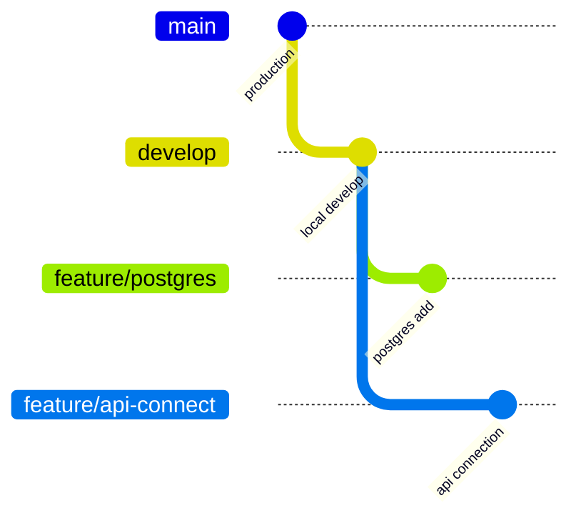

develop
feature/postgres

```mermaid
gitGraph
commit id: "production "
branch develop
checkout develop
commit id: "local develop "


branch feature/postgres
checkout feature/postgres
commit id: "postgres add"
checkout develop

branch feature/api-connect
checkout feature/api-connect
commit id: "api connection"
```
